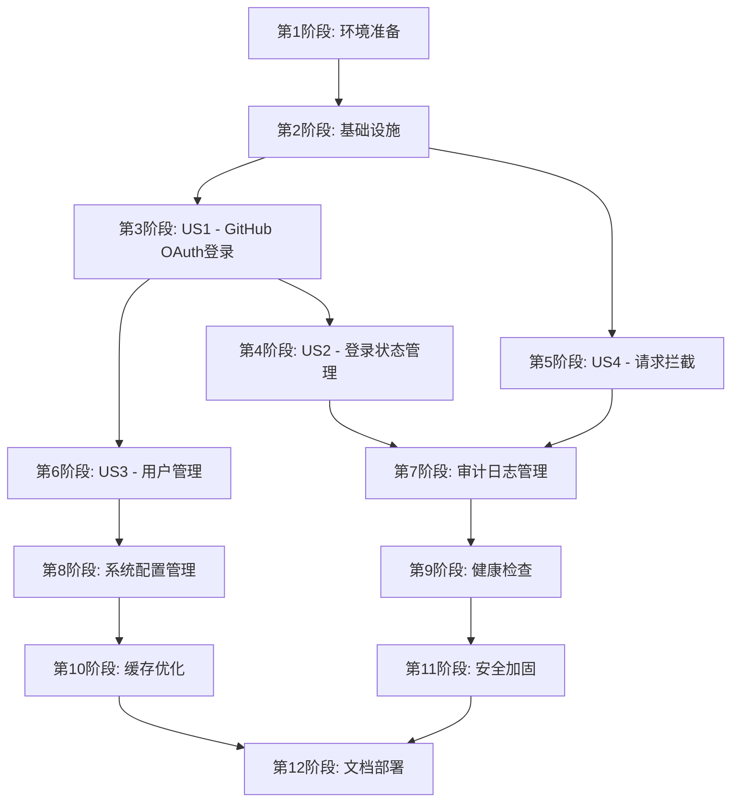

# 任务列表: GitHub OAuth 登录功能完善

## 第1阶段: 环境准备

**目标**: 准备开发环境和基础配置

- [ ] T001 配置 GitHub OAuth 应用参数到 application.yml
- [ ] T002 [P] 创建数据库迁移脚本 (用户表扩展)
- [ ] T003 [P] 创建数据库迁移脚本 (审计日志表)
- [ ] T004 执行数据库迁移脚本
- [ ] T005 [P] 配置白名单路径到 application.yml

## 第2阶段: 基础设施

**目标**: 实现共享的基础组件和配置

- [ ] T006 [P] 扩展 Users 实体类 - beinet-deployment/beinet-dp-admin/src/main/java/cn/beinet/deployment/admin/users/dal/entity/Users.java
- [ ] T007 [P] 创建 AuditLogs 实体类 - beinet-business/beinet-login/src/main/java/cn/beinet/business/login/dal/entity/AuditLogs.java
- [ ] T008 [P] 创建 WhitelistConfig 配置类 - beinet-business/beinet-login/src/main/java/cn/beinet/business/login/config/WhitelistConfig.java
- [ ] T009 [P] 创建 AuditEventType 枚举 - beinet-business/beinet-login/src/main/java/cn/beinet/business/login/enums/AuditEventType.java
- [ ] T010 创建 AuditLogsMapper 接口 - beinet-business/beinet-login/src/main/java/cn/beinet/business/login/dal/mapper/AuditLogsMapper.java
- [ ] T011 扩展 UsersMapper 接口 - beinet-deployment/beinet-dp-admin/src/main/java/cn/beinet/deployment/admin/users/dal/UsersMapper.java

## 第3阶段: 用户故事1 - GitHub OAuth 登录 (P1)

**目标**: 完善 GitHub OAuth 登录流程，包括用户信息持久化和审计日志
**独立测试**: 用户可以通过 GitHub OAuth 完成登录，系统正确存储用户信息并记录审计日志

- [ ] T012 [US1] 扩展 UserDto 类 - beinet-sdk/beinet-login-sdk/src/main/java/cn/beinet/sdk/login/dto/UserDto.java
- [ ] T013 [US1] 创建 AuditLogDto 类 - beinet-business/beinet-login/src/main/java/cn/beinet/business/login/dto/AuditLogDto.java
- [ ] T014 [US1] 创建 AuditLogService 服务 - beinet-business/beinet-login/src/main/java/cn/beinet/business/login/service/AuditLogService.java
- [ ] T015 [US1] 扩展 LoginService 服务 - beinet-business/beinet-login/src/main/java/cn/beinet/business/login/service/LoginService.java
- [ ] T016 [US1] 扩展 LoginController 控制器 - beinet-business/beinet-login/src/main/java/cn/beinet/business/login/LoginController.java
- [ ] T017 [US1] 集成测试 GitHub OAuth 完整登录流程

## 第4阶段: 用户故事2 - 登录状态管理 (P1)

**目标**: 实现用户登出功能和 Token 黑名单机制
**独立测试**: 用户可以主动登出，登出后 Token 失效，无法访问受保护资源

- [ ] T018 [US2] 创建 TokenBlacklistService 服务 - beinet-business/beinet-login/src/main/java/cn/beinet/business/login/service/TokenBlacklistService.java
- [ ] T019 [US2] 实现登出接口 - beinet-business/beinet-login/src/main/java/cn/beinet/business/login/LoginController.java
- [ ] T020 [US2] 扩展 TokenValidator 验证器 - beinet-business/beinet-login/src/main/java/cn/beinet/business/login/loginValidate/TokenValidator.java
- [ ] T021 [US2] 实现获取用户信息接口 - beinet-business/beinet-login/src/main/java/cn/beinet/business/login/LoginController.java
- [ ] T022 [US2] 扩展 LoginSdk 接口 - beinet-sdk/beinet-login-sdk/src/main/java/cn/beinet/sdk/login/LoginSdk.java
- [ ] T023 [US2] 集成测试登出流程和 Token 失效

## 第5阶段: 用户故事4 - 请求拦截与权限控制 (P1)

**目标**: 优化请求拦截机制，支持白名单配置和审计日志
**独立测试**: 未登录用户访问受保护资源被拦截，白名单路径可正常访问，所有认证事件被记录

- [ ] T024 [US4] 扩展 NoNeedLoginValidator 验证器 - beinet-business/beinet-login/src/main/java/cn/beinet/business/login/loginValidate/NoNeedLoginValidator.java
- [ ] T025 [US4] 优化 AuthorizationFilter 过滤器 - beinet-deployment/beinet-dp-admin/src/main/java/cn/beinet/deployment/admin/autoConfig/AuthorizationFilter.java
- [ ] T026 [US4] 创建 AuthExceptionHandler 异常处理器 - beinet-business/beinet-login/src/main/java/cn/beinet/business/login/exception/AuthExceptionHandler.java
- [ ] T027 [US4] 创建 AuthenticationException 异常类 - beinet-business/beinet-login/src/main/java/cn/beinet/business/login/exception/AuthenticationException.java
- [ ] T028 [US4] 集成测试请求拦截和白名单功能

## 第6阶段: 用户故事3 - 用户信息管理 (P2)

**目标**: 实现用户信息的查询和管理功能
**独立测试**: 管理员可以查看用户列表、用户详情，可以禁用/启用用户

- [ ] T029 [US3] 创建 UserManagementService 服务 - beinet-business/beinet-login/src/main/java/cn/beinet/business/login/service/UserManagementService.java
- [ ] T030 [US3] 扩展 UsersController 控制器 - beinet-deployment/beinet-dp-admin/src/main/java/cn/beinet/deployment/admin/users/controller/UsersController.java
- [ ] T031 [US3] 扩展 UsersService 服务 - beinet-deployment/beinet-dp-admin/src/main/java/cn/beinet/deployment/admin/users/service/UsersService.java
- [ ] T032 [US3] 创建用户状态更新接口 - beinet-deployment/beinet-dp-admin/src/main/java/cn/beinet/deployment/admin/users/controller/UsersController.java
- [ ] T033 [US3] 集成测试用户管理功能

## 第7阶段: 审计日志管理

**目标**: 实现审计日志的查询和统计功能
**独立测试**: 管理员可以查看审计日志列表、按条件筛选、查看统计信息

- [ ] T034 [P] 创建 AuditLogController 控制器 - beinet-deployment/beinet-dp-admin/src/main/java/cn/beinet/deployment/admin/auditlog/AuditLogController.java
- [ ] T035 [P] 创建 AuditLogQueryDto 查询参数类 - beinet-deployment/beinet-dp-admin/src/main/java/cn/beinet/deployment/admin/auditlog/dto/AuditLogQueryDto.java
- [ ] T036 [P] 创建 AuditLogStatisticsDto 统计结果类 - beinet-deployment/beinet-dp-admin/src/main/java/cn/beinet/deployment/admin/auditlog/dto/AuditLogStatisticsDto.java
- [ ] T037 实现审计日志查询接口 - beinet-deployment/beinet-dp-admin/src/main/java/cn/beinet/deployment/admin/auditlog/AuditLogController.java
- [ ] T038 实现审计日志统计接口 - beinet-deployment/beinet-dp-admin/src/main/java/cn/beinet/deployment/admin/auditlog/AuditLogController.java
- [ ] T039 集成测试审计日志查询和统计功能

## 第8阶段: 系统配置管理

**目标**: 实现白名单配置的查询和更新功能
**独立测试**: 管理员可以查看和更新白名单配置

- [ ] T040 [P] 创建 ConfigController 控制器 - beinet-deployment/beinet-dp-admin/src/main/java/cn/beinet/deployment/admin/config/ConfigController.java
- [ ] T041 [P] 创建 WhitelistConfigDto 配置传输类 - beinet-deployment/beinet-dp-admin/src/main/java/cn/beinet/deployment/admin/config/dto/WhitelistConfigDto.java
- [ ] T042 实现白名单配置查询接口 - beinet-deployment/beinet-dp-admin/src/main/java/cn/beinet/deployment/admin/config/ConfigController.java
- [ ] T043 实现白名单配置更新接口 - beinet-deployment/beinet-dp-admin/src/main/java/cn/beinet/deployment/admin/config/ConfigController.java
- [ ] T044 集成测试配置管理功能

## 第9阶段: 健康检查和监控

**目标**: 实现认证服务的健康检查功能
**独立测试**: 健康检查接口正常返回各组件状态

- [ ] T045 [P] 创建 AuthHealthIndicator 健康检查器 - beinet-business/beinet-login/src/main/java/cn/beinet/business/login/health/AuthHealthIndicator.java
- [ ] T046 [P] 创建 HealthCheckDto 健康状态类 - beinet-business/beinet-login/src/main/java/cn/beinet/business/login/dto/HealthCheckDto.java
- [ ] T047 实现认证服务健康检查 - beinet-business/beinet-login/src/main/java/cn/beinet/business/login/health/AuthHealthIndicator.java
- [ ] T048 集成测试健康检查功能

## 第10阶段: 缓存和性能优化

**目标**: 实现 Redis 缓存优化，提升系统性能
**独立测试**: 缓存功能正常工作，性能指标达到要求

- [ ] T049 [P] 创建 CacheService 缓存服务 - beinet-business/beinet-login/src/main/java/cn/beinet/business/login/service/CacheService.java
- [ ] T050 [P] 配置 Redis 缓存注解 - beinet-business/beinet-login/src/main/java/cn/beinet/business/login/config/CacheConfig.java
- [ ] T051 在 UserManagementService 中添加缓存 - beinet-business/beinet-login/src/main/java/cn/beinet/business/login/service/UserManagementService.java
- [ ] T052 在 TokenBlacklistService 中添加缓存 - beinet-business/beinet-login/src/main/java/cn/beinet/business/login/service/TokenBlacklistService.java
- [ ] T053 性能测试和优化验证

## 第11阶段: 安全加固和完善

**目标**: 实现安全加固措施和错误处理完善
**独立测试**: 安全措施正常工作，错误处理完善

- [ ] T054 [P] 创建 SecurityUtils 安全工具类 - beinet-business/beinet-login/src/main/java/cn/beinet/business/login/utils/SecurityUtils.java
- [ ] T055 [P] 创建 RateLimitService 限流服务 - beinet-business/beinet-login/src/main/java/cn/beinet/business/login/service/RateLimitService.java
- [ ] T056 实现登录限流功能 - beinet-business/beinet-login/src/main/java/cn/beinet/business/login/service/LoginService.java
- [ ] T057 完善全局异常处理 - beinet-business/beinet-login/src/main/java/cn/beinet/business/login/exception/AuthExceptionHandler.java
- [ ] T058 安全测试和渗透测试验证

## 第12阶段: 文档和部署

**目标**: 完善文档和部署配置
**独立测试**: 文档完整，部署配置正确

- [ ] T059 [P] 更新 API 文档 (Swagger 注解)
- [ ] T060 [P] 创建数据库迁移回滚脚本
- [ ] T061 [P] 更新 README.md 文档
- [ ] T062 创建部署检查清单
- [ ] T063 端到端集成测试

## 依赖关系

## 并行执行机会

### 第2阶段内 (基础设施)
T006, T007, T008, T009 可以并行执行 (不同文件)

### 第3阶段内 (US1)
T012, T013 可以并行执行 (不同模块)
T014, T015 依赖 T012, T013 完成

### 第7阶段内 (审计日志)
T034, T035, T036 可以并行执行 (不同文件)

### 第8阶段内 (系统配置)
T040, T041 可以并行执行 (不同文件)

### 第10阶段内 (缓存优化)
T049, T050 可以并行执行 (不同文件)
T051, T052 可以并行执行 (不同服务)

## 实施策略

### MVP 范围
完成第1-5阶段可提供最小可用产品：
- GitHub OAuth 登录
- 用户信息持久化
- 登录状态管理
- 请求拦截和权限控制

### 增量交付
每个用户故事阶段都可以独立测试和交付：
- 第3阶段: 基础登录功能
- 第4阶段: 登录状态管理
- 第5阶段: 安全拦截
- 第6阶段: 用户管理

### 质量保证
- 每个阶段完成后进行集成测试
- 第12阶段进行完整的端到端测试
- 安全测试贯穿整个开发过程

## 检查点

### 第3阶段完成检查点
- [ ] GitHub OAuth 登录流程正常工作
- [ ] 用户信息正确存储到数据库
- [ ] 审计日志正确记录登录事件
- [ ] JWT Token 正确生成和验证

### 第5阶段完成检查点
- [ ] 未登录用户被正确拦截
- [ ] 白名单路径可以正常访问
- [ ] 认证失败事件被正确记录
- [ ] 错误响应格式统一

### 第12阶段完成检查点
- [ ] 所有功能正常工作
- [ ] 性能指标达到要求
- [ ] 安全测试通过
- [ ] 文档完整准确